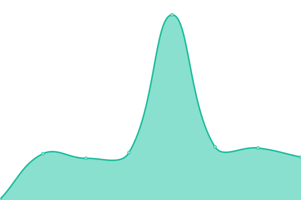
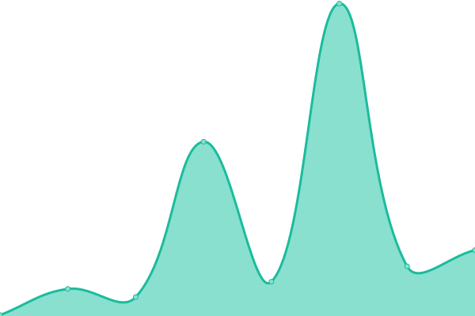
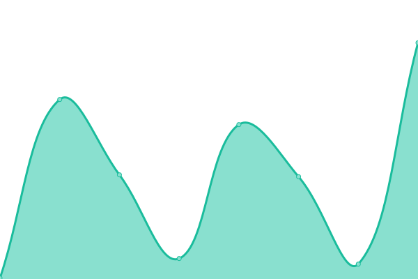

# [📈 Live Status](https://demo.upptime.js.org): <!--live status--> **🟧 Partial outage**

This repository contains the open-source uptime monitor and status page for [lvz21012](https://demo.upptime.js.org), powered by [Upptime](https://github.com/upptime/upptime).

With [Upptime](https://upptime.js.org), you can get your own unlimited and free uptime monitor and status page, powered entirely by a GitHub repository. We use [Issues](https://github.com/lvz21012/bancomermonitor/issues) as incident reports, [Actions](https://github.com/lvz21012/bancomermonitor/actions) as uptime monitors, and [Pages](https://demo.upptime.js.org) for the status page.

<!--start: status pages-->
<!-- This summary is generated by Upptime (https://github.com/upptime/upptime) -->
<!-- Do not edit this manually, your changes will be overwritten -->
<!-- prettier-ignore -->
| URL | Status | History | Response Time | Uptime |
| --- | ------ | ------- | ------------- | ------ |
|  [Google](https://www.google.com) | 🟩 Up | [google.yml](https://github.com/lvz21012/bancomermonitor/commits/HEAD/history/google.yml) | 

 79ms
     
 | 

<a href="https://demo.upptime.js.org/history/google">100.00%</a>
    

|  [Hogar](https://cotizadores.bbvaseguros.mx/psns_mult_web_psnspublicwebapp_02/seguroHogarDinamico#/paso1-perfilador) | 🟥 Down | [hogar.yml](https://github.com/lvz21012/bancomermonitor/commits/HEAD/history/hogar.yml) | 

 595ms
     
 | 

<a href="https://demo.upptime.js.org/history/hogar">99.28%</a>
    

|  [Vida](https://seguros.bbva.mx/index.html#!/segurovida/cuestionarioPerfilador) | 🟩 Up | [vida.yml](https://github.com/lvz21012/bancomermonitor/commits/HEAD/history/vida.yml) | 

 442ms
     
 | 

<a href="https://demo.upptime.js.org/history/vida">100.00%</a>
    

|  [Medico particular](https://seguros.bbva.mx/index.html#!/seguro-salud-particular/intro) | 🟩 Up | [medico-particular.yml](https://github.com/lvz21012/bancomermonitor/commits/HEAD/history/medico-particular.yml) | 

 57ms
     
 | 

<a href="https://demo.upptime.js.org/history/medico-particular">100.00%</a>
    

|  [Mascotas](https://seguros.bbva.mx/index.html#!/seguro-para-mascotas) | 🟩 Up | [mascotas.yml](https://github.com/lvz21012/bancomermonitor/commits/HEAD/history/mascotas.yml) | 

 62ms
     
 | 

<a href="https://demo.upptime.js.org/history/mascotas">100.00%</a>
    

|  [Estudia](https://cotizadores.bbvaseguros.mx/psns_mult_web_psnspublicwebapp_02/seguroEstudia#/paso1-perfilador) | 🟩 Up | [estudia.yml](https://github.com/lvz21012/bancomermonitor/commits/HEAD/history/estudia.yml) | 

 305ms
     
 | 

<a href="https://demo.upptime.js.org/history/estudia">99.29%</a>
    

|  [TLMK](https://segbancomer.mx/psmx_mult_web_psmxwebapp_01/public/login) | 🟩 Up | [tlmk.yml](https://github.com/lvz21012/bancomermonitor/commits/HEAD/history/tlmk.yml) | 

 573ms
     
 | 

<a href="https://demo.upptime.js.org/history/tlmk">100.00%</a>
    

|  [Auto](https://cotizadores.bbvaseguros.mx/psns_mult_web_psnspublicwebapp_02/autoSeguroBancomer#/paso1-datos-basicos-auto) | 🟥 Down | [auto.yml](https://github.com/lvz21012/bancomermonitor/commits/HEAD/history/auto.yml) | 

 306ms
     
 | 

<a href="https://demo.upptime.js.org/history/auto">100.00%</a>
    

|  [Wibe](https://www.wibe.com/cotizadores/seguro-auto#/paso1-datos-basicos-auto-conductor) | 🟩 Up | [wibe.yml](https://github.com/lvz21012/bancomermonitor/commits/HEAD/history/wibe.yml) | 

 899ms
     
 | 

<a href="https://demo.upptime.js.org/history/wibe">100.00%</a>
    

|  [Test Broken Site](https://thissitedoesnotexist.koj.co) | 🟥 Down | [test-broken-site.yml](https://github.com/lvz21012/bancomermonitor/commits/HEAD/history/test-broken-site.yml) | 

 0ms
     
 | 

<a href="https://demo.upptime.js.org/history/test-broken-site">100.00%</a>
    

<!--end: status pages-->

[**Visit our status website →**](https://demo.upptime.js.org)

## 📄 License

- Powered by: [Upptime](https://github.com/upptime/upptime)
- Code: [MIT](./LICENSE) © [lvz21012](https://demo.upptime.js.org)
- Data in the `./history` directory: [Open Database License](https://opendatacommons.org/licenses/odbl/1-0/)
